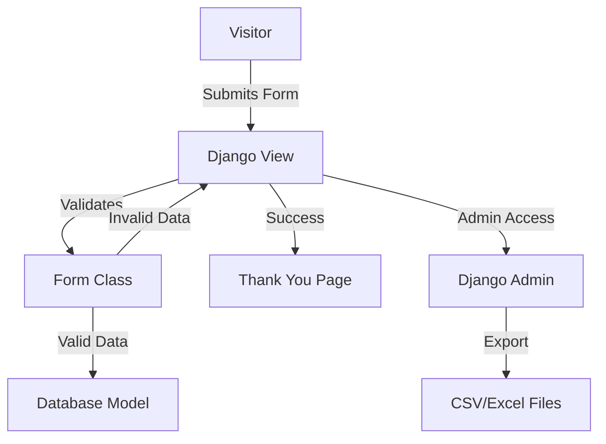

# Book Launch Django App - Implementation Plan

## Project Overview
A Django web application for collecting visitor information during a book launch event. The app will collect name, phone number, email, and location from visitors, store the data in a database, and provide an admin interface with export capabilities.

## Technology Stack
- **Backend**: Django 4.x (Python)
- **Frontend**: HTML5, CSS3, Bootstrap 5
- **Database**: SQLite (default, can be switched to PostgreSQL for production)
- **Export Libraries**: csv (built-in), openpyxl (for Excel)

## System Architecture



## Database Schema

### Visitor Model
```python
class Visitor(models.Model):
    name = models.CharField(max_length=200)
    phone_number = models.CharField(max_length=20)
    email = models.EmailField()
    location = models.CharField(max_length=200)
    created_at = models.DateTimeField(auto_now_add=True)
```

## File Structure
```
book_launch/
├── manage.py
├── book_launch/
│   ├── __init__.py
│   ├── settings.py
│   ├── urls.py
│   ├── wsgi.py
│   └── asgi.py
├── visitors/
│   ├── __init__.py
│   ├── admin.py
│   ├── apps.py
│   ├── forms.py
│   ├── models.py
│   ├── urls.py
│   └── views.py
├── templates/
│   ├── base.html
│   ├── visitors/
│   │   ├── register.html
│   │   └── thank_you.html
├── static/
│   └── css/
│       └── custom.css
├── requirements.txt
├── README.md
└── DEPLOYMENT.md
```

## Implementation Steps

### 1. Set up Django Project Structure
- Initialize Django project named `book_launch`
- Create Django app named `visitors`
- Configure settings (INSTALLED_APPS, static files, templates)
- Set up URL routing

### 2. Create Database Model
- Define `Visitor` model with fields:
  - `name` (CharField, max_length=200)
  - `phone_number` (CharField, max_length=20)
  - `email` (EmailField)
  - `location` (CharField, max_length=200)
  - `created_at` (DateTimeField, auto_now_add=True)
- Create and apply migrations

### 3. Create Django Form
- Create `VisitorForm` class using `ModelForm`
- Add form validation for:
  - Phone number format
  - Email format
  - Required fields

### 4. Build Views
- `register_visitor`: Handle form submission and validation
- `thank_you`: Display success message after registration
- Export views (for admin):
  - `export_csv`: Export all visitors to CSV
  - `export_excel`: Export all visitors to Excel

### 5. Configure Django Admin
- Register `Visitor` model with admin
- Add custom admin actions for CSV/Excel export
- Configure list display and search fields

### 6. Create Templates
- `base.html`: Base template with Bootstrap CDN and common layout
- `visitors/register.html`: Registration form with Bootstrap styling
- `visitors/thank_you.html`: Thank you page with confirmation message

### 7. Implement Form Validation
- Add client-side validation using Bootstrap form classes
- Add server-side validation in Django form
- Display error messages clearly to users

### 8. Add Export Functionality
- Implement CSV export using Python's csv module
- Implement Excel export using openpyxl library
- Add export buttons in Django admin interface

### 9. Create Documentation
- `README.md`: Setup instructions, features overview
- `DEPLOYMENT.md`: Server deployment guide
- Include requirements.txt with all dependencies

## Key Features

### Visitor Registration Form
- Clean, responsive Bootstrap 5 form
- Fields: Name, Phone Number, Email, Location
- Real-time validation feedback
- Mobile-friendly design

### Admin Interface
- View all visitor submissions
- Search and filter submissions
- Export to CSV format
- Export to Excel format
- View submission timestamps

### Thank You Page
- Confirmation message
- Option to submit another registration
- Clean, professional design

## Dependencies
```
Django>=4.2,<5.0
openpyxl>=3.1.0
```

## Security Considerations
- CSRF protection enabled (Django default)
- Input validation and sanitization
- Secure admin interface with login
- Environment variables for sensitive configuration

## Deployment Notes
- Set `DEBUG=False` for production
- Configure `ALLOWED_HOSTS`
- Use production database (PostgreSQL recommended)
- Set up static files serving
- Configure Gunicorn or uWSGI as application server
- Set up Nginx as reverse proxy (recommended)

## Testing Checklist
- [ ] Form submission works correctly
- [ ] Validation errors display properly
- [ ] Thank you page appears after successful submission
- [ ] Admin interface accessible and functional
- [ ] CSV export works
- [ ] Excel export works
- [ ] Responsive design works on mobile devices
- [ ] All required fields are validated
- [ ] Phone number format validation
- [ ] Email format validation
